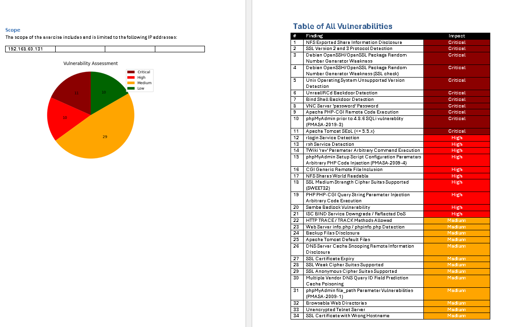

# Vulnerability Assessment Report PDF Automation

This project automates the creation of a vulnerability assessment report from a CSV file containing vulnerability data. It transforms scan results into a well-structured Word document, featuring:

- A **pie chart** illustrating the distribution of vulnerabilities by severity levels (Critical, High, Medium, Low, Info).
- **Detailed tables** for each vulnerability, highlighting risk level, affected hosts, CVEs, and remediation suggestions.
- Each table is presented on a **separate page** for clearer readability and organization.

## Use Case: Automating Vulnerability Reporting

The script processes the results from a vulnerability scan tool "Nessus", similar to the scan result shown below:


## Overview of the Process for Generating a Report

1. **Vulnerability Scanning**:
   - I conducted a vulnerability scan on a machine that contained several vulnerabilities.


2. **Exporting Results**:
   - After the scan, the results were exported as an **Excel sheet** containing details such as severity levels (Critical, High, Medium, Low), CVSS scores, affected hosts, and other relevant information.
   
   

3. **Running the Python Script**:
   - I executed the Python script, providing the exported **Excel sheet** as input. The script analyzed the data and generated a Word report. The command to run the script is:

   ```bash
   python nessus.py "<Name-File.csv>"
   python nessus.py "Vulnberable system_cu39nf.csv"
 

4. **Generating the Word Report**:
   - The resulting **Word file** included:
     1. A **pie chart** that visualized the distribution of vulnerabilities by severity levels: Critical, High, Medium, and Low.
     2. **Well-organized tables** for each vulnerability. These tables were sorted by severity, starting from **Critical** down to **Low**, making it easy to prioritize the most urgent vulnerabilities.

   
   

6. **Presentation and Organization**:
   - The Word report was neatly formatted, with each vulnerability placed in a separate table. This organization ensured that the details were clear and easy to read.
   - The vulnerabilities were presented in a structured manner, starting with the most critical ones, making it easier to assess the system's security and prioritize fixes.

   

7. **Using the Report in a Corporate Template**:
   - The generated Word document was formatted in such a way that I could easily transfer it into my company's report **template**.
   - The vulnerabilities were listed clearly, with charts and tables that made the information visually appealing and easy to understand, making it ready for submission to internal customers or clients.

---

The scan output shows a list of vulnerabilities with details such as:
- **Severity Level**: Critical, High, Medium, Low, Info.
- **CVE**: The unique identifier for the vulnerability, which helps track and reference it.
- **Vulnerability Name**: The name or type of the vulnerability.
- **Affected Hosts**: The hosts affected by this vulnerability.
- **Count**: The number of instances detected.
- **Description**: A brief explanation or details about the vulnerability.


## How It Works

This script reads a CSV file containing vulnerability data from the scan results and generates a Word document with:
1. A **pie chart** that visualizes the distribution of vulnerabilities by severity level.
2. A detailed **table for each vulnerability**, including the risk level, affected hosts, CVEs, and remediation suggestions. Each table is placed on a separate page for easier reading and review.

## Installation and Setup

1. **Install Required Python Libraries**

   To use the script, you'll need to install the following libraries:

   ```bash
   pip install python-docx matplotlib
