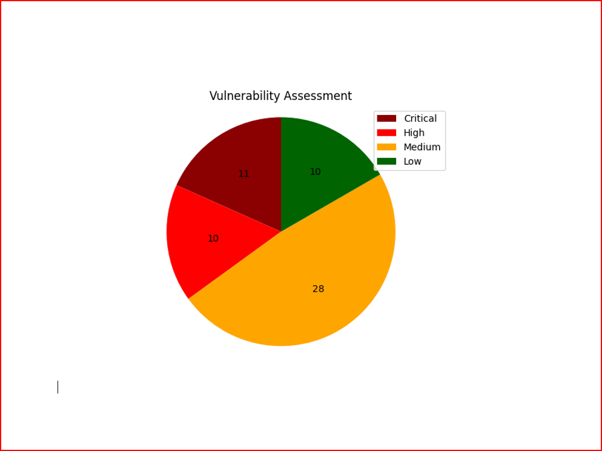

# Vulnerability Assessment Report Automation

This project automates the creation of a vulnerability assessment report from a CSV file of vulnerability data. It converts scan results into a well-formatted Word document that includes:

- A **pie chart** showing the distribution of vulnerabilities based on severity levels (Critical, High, Medium, Low, Info).
- **Tables** for each vulnerability, providing details such as risk level, affected hosts, CVE references, and remediation suggestions.
- Each table is displayed on a **separate page** for cleaner formatting.

## Use Case: Automating the Vulnerability Report

This project is designed to work with results from a vulnerability scan tool, such as the one shown in the image below:


# Overview of the Process for Generating a Vulnerability Report

1. **Vulnerability Scanning**:
   - Initially, I performed a vulnerability scan on a machine that contained various vulnerabilities.

2. **Exporting Results**:
   - After the scan was completed, I exported the results as an **Excel sheet**. The file contained all the detected vulnerabilities, including details like severity (Critical, High, Medium, Low), CVSS scores, affected hosts, and other related information.


3. **Running the Python Script**:
   - Next, I used the Python script designed to generate a structured report. I provided the **Excel sheet** as input to the script. 
   - The script processed the data, analyzed the vulnerabilities, and then created a Word document.

4. **Generating the Word Report**:
   - The resulting **Word file** included:
     1. **A pie chart** that visualized the distribution of vulnerabilities by severity levels: Critical, High, Medium, and Low.
     2. **Well-organized tables** for each vulnerability. These tables were sorted by severity, starting from **Critical** down to **Low**, making it easy to prioritize the most urgent vulnerabilities.

5. **Presentation and Organization**:
   - The Word report was neatly formatted, with each vulnerability placed in a separate table. This organization ensured that the details were clear and readable.
   - The vulnerabilities were presented in a structured manner, starting with the most critical ones, which made it easier to assess the system's security status and prioritize fixes.

6. **Using the Report in a Corporate Template**:
   - The generated Word document was formatted in such a way that I could easily transfer it into my company's report **template**.
   - The vulnerabilities were listed clearly, with charts and tables that made the information visually appealing and easy to understand. This made it ready for submission to internal stakeholders or clients.

The scan output shows a list of vulnerabilities with details like:
- **Severity Level**: Critical, High, Medium, Low, Info
- **CVSS Score**: A score that quantifies the severity of the vulnerability.
- **Vulnerability Name**: The name or type of the vulnerability.
- **Family**: The category or family the vulnerability belongs to.
- **Affected Hosts**: The hosts affected by this vulnerability.
- **Count**: The number of instances detected.

## How It Works

This script reads a CSV file that contains vulnerability data from the scan results. It generates a Word document with:
1. A **pie chart** that visualizes the distribution of vulnerabilities by risk level.
2. A detailed **table for each vulnerability**, including the risk level, affected hosts, CVEs, and remediation suggestions. Each table is placed on a separate page for easier reading and review.

## Features

- **Automated report generation**: Converts CSV data into a structured Word report.
- **Pie chart for visual insights**: Quickly understand the severity distribution.
- **Color-coded risk levels**: Each vulnerability's risk level is color-coded for clarity.
- **Supports multiple hosts**: Lists all affected hosts for each vulnerability.
- **Page breaks for each vulnerability**: Ensures that each vulnerability is presented clearly.

## Installation and Setup

1. **Install Required Python Libraries**

   To use the script, you'll need to install the following libraries:

   ```bash
   pip install python-docx matplotlib
